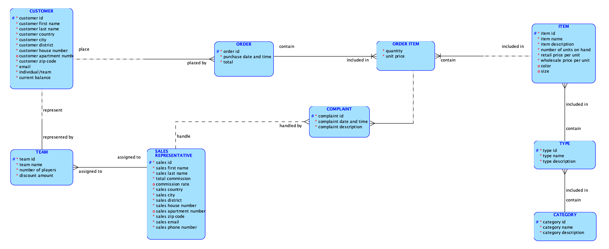

# Oracle baseball league store database system

## Project overview

A well-structured database system is fundamental for any retail operation to manage its data efficiently, ensure consistency, and provide meaningful insights for decision-making. This project focuses on designing a detailed relational database system for Oracle Baseball League (OBL) Store—a specialized store serving baseball enthusiasts in its local community.

This database will support OBL’s operations by enabling organized data storage, faster transaction processing, and scalable customer and order management. It allows seamless tracking of inventory, orders, and sales representatives, while also incorporating discount logic for team-based purchases.

---

## Business context

The Oracle Baseball League Store caters to two customer segments:

- **Individual customers** who buy items such as balls, cleats, gloves, shirts, and shorts.
- **Teams** who purchase uniforms and equipment in bulk, receiving discounts based on the number of players.

OBL also employs a small team of sales representatives who manage team orders and occasionally assist individual customers.

Previously, all information was manually recorded or stored in spreadsheets, leading to data duplication, loss of records, and poor visibility into inventory and customer behavior. With growing operations and increasing order volumes, a dedicated database system is essential to streamline operations and enable future digital integration (e.g., POS system, reporting dashboards, or an online store).

For full requirements of the store, please have take a look at [Requirements](https://github.com/JakeLe-LKA/Baseball-Store-Database-Design/blob/main/Baseball_store_requirements.pdf)

---

## Result

The proposed database model includes the following main components:

- **Customer management**: Differentiates individual and team customers while supporting contact and discount information.
- **Order and Order Item tracking**: Enables full order history, linked to both products and customers.
- **Inventory management**: Tracks available products, categories, and pricing.
- **Sales representatives**: Maintains a record of the internal team handling team accounts and complaints.

> 📌 *Below is a visualization of the final database design:*  

---

## Conclusion & Recommendation

A dedicated database system will bring several benefits to OBL Store:

- **Operational efficiency**: Orders, inventory, and customer data are centralized and easier to access and maintain.
- **Data accuracy**: Reduced manual entry errors and improved data integrity.
- **Scalability**: Supports future expansions like online ordering, automated reports, or CRM systems.
- **Customer segmentation**: Enables better service and promotions for both individuals and teams.

### Recommendation for future work

- Integrate the database with a **Point-of-Sale (POS)** system to track real-time purchases and inventory.
- Build a **reporting dashboard** to analyze product sales, customer behavior, and team order trends.
- Develop a **web-based interface** for staff and customers to interact directly with the system (e.g., placing orders, tracking shipments).

This database lays a strong foundation for digital transformation at OBL Store, enhancing both its customer service and internal operations.

